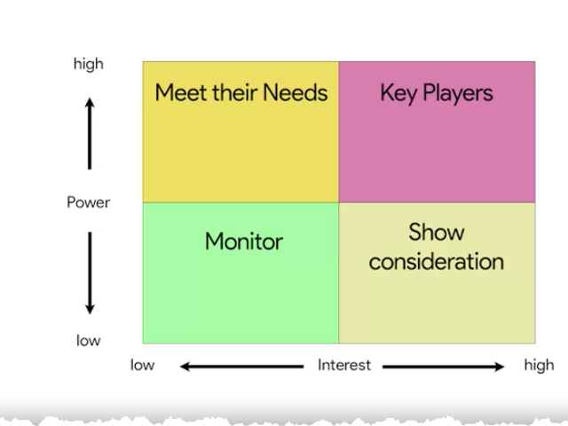

# Exploring project team roles and responsibilities

> ### Stakeholders
>
> People who are interested in and affected by the project's completion and success

Each person involved has a set role and set responsibilities to help bring the project to a landing. Those roles include project sponsors, customers, team members, and the project manager. We will go over tools that help clarify roles and responsibilities and prevent confusion on who takes ownership of which tasks such as, stakeholder mapping and analysis and RACI charts.

## Accessibility for project managers

Accessibility should be incorporated into every role at a company, whether a product designer, communicator, developer or project manager. Accessibility can be defined in a number of different ways.

> ### Accessibility
>
> Actively removing any barriers that might prevent persons with disabilities from being able to access technology, information, or experiences, and leveling in the playing field so everyone has an equal chance of enjoying life and being successful

A disability is often defined as a physical or mental condition that substantially limits a major life activity, such as walking, talking, seeing, hearing, or learning. Over one billion people in the world have a disability. That's more than the population of the United States, Canada, France, Italy, Japan, Mexico, and Brazil combined. Disability is diverse and intersectional. Someone can be born with a condition or acquire it later in life .Disability can affect us all in some way, whether directly or indirectly, and at any time, from permanent, like deafness, to temporary, like a broken leg, to situational, like trying to operate a TV remote control in the dark.

When you create solutions for persons with disabilities, you are not only serving the critical audience of people with permanent disabilities, you are also unlocking secondary benefits for everyone who may move in and out of disability over time. Set expectation that you'll be interacting with others that learn and work differently is a key strength of working with accessibility in mind. Asking others what they need from you to learn and communicate and also sharing what you need if you have disability yourself is important to working well together as a team.

In project management, people on your project team, or people highly invested in your project may have a disability, whether visible or invisible.

> As a project manager, you are responsible for making sure a group of people can come together to achieve a common goal using shared tools and systems

In order to be successful, you meed to make sure the infrastructure and culture you set up works for everyone. Knowing this is a key element of project management.

Did you know that many technologies that we all enjoy started out as an accessibility feature? The Google Assistant, which allows you to control your home with your voice, or close captioning, which makes it possible to watch the TV above a crowded, noisy bar. By considering accessibility, you can impact everyone's lives for the better.

## Choosing a project team

In order to decide who does what on a project, we have to consider and outline our needs. Choosing the right people for a team is a big task, and one every project manager should take seriously. These are the people who do the work on the project, so we want to make sure we have the right people lined up. When identifying people resources, we need to carefully consider the project needs and use that info to guide our decision-making.

> ## When choosing a team, consider:
>
> - Required roles
> - Team size, based on tasks clearly laid out and the size of the project
> - Necessary Skills, project manager ensures that everyone on the team has the right skills to do the job.
> - Availability, consider motivation. Do they want a promotion? Are they working on another project?

Ask questions to decide who you need on your team, such as staff experience, availability, the workspace, team member workload on other projects, and more. There's no exact formula for putting together the right team, which makes it a little tricky. Every situation is different and calls for a different set of skills, experience, and perspectives. It can be helpful to look deeper into each task on the project.

Always ask yourself these questions:

- How many people do I need on my team each step of the way?
- Which team members do I need and when?
- Are those experts already busy on other projects?
- Who makes the final decisions on project resources?

## Review: The building blocks of a project dream team

### Too big, too small, or just right?

Once you lay the foundation for your project by outlining your goals and expectations, it is time to build your dream team. Though before we can build your dream team, we need to figure out how many people we need. This number will largely depend on the size of the project itself. Complex projects with large divisions of work will usually require larger project teams. Simple projects with straightforward expectations may only require a few people on the project team. As a project manager, it is your job to help find the right balance based on what is needed.

### The right skills and abilities to fill the role

Multiple roles exist in every project. On smaller teams, multiple roles may be filled by one person. To meet the needs of more specialized projects, project managers might require people who have the necessary **technical skills**. Technical skills are the skills specific to the task that needs to be performed.

Technical skills are highly valued, but they are not the only skills that are important for high functioning teams. Interpersonal skills, also known as people skills or soft skills, such as patience and conflict mediation, can help team members. This allows the team to blend their technical expertise with collaborative skills in order to get the job done. When a team applies their interpersonal skills, they can minimize team-related issues.

**Problem-solving skills** are a must for all team members, especially when it comes to large, complex projects. As a project manager, you will not be able to solve every problem for your team. At some point, they will need to use their own judgment to problem-solve and get the work done.

An underrated skill set for project team members are **leadership skills**. Strong leadership skills help team members navigate organizational boundaries and effectively communicate with stakeholders to generate buy-in.

### Who is available?

In projects, the availability of your team is always a big concern. This is especially tru in Matrix organizations, where team members have multiple bosses. It is not uncommon to pull a team member onto another project before your project is complete. in a perfect world, you only pick those who can stay on the project for its entire life cycle. You may find that you don't get to pick certain members of your team at all, which is called a pre-assignment. In these cases, the sponsor assigns team members to your project.

Keep in mind that you need to value diversity early on when building you team. On diverse teams, everyone is able to use their unique professional and personal experiences to contribute to a more successful project. Diversity is best leveraged when it is acknowledged and highlighted as an asset. Many people avoid discussing their differences, but if you encourage those conversations, you will find a richer understanding and greater creativity that comes from people working together across identity differences. To do this effectively, it is important to dedicate time early on in the team building process to develop trust between team members. Team members who understand one another are more likely to trust each other and feel safe sharing different points of view or offer a competing perspective. This will also allow them to more easily offer constructive feedback or be supportive if the team dynamics face challenges at any point.

### What motivates them?

Be sure to take note of the motivational level of your team members and the impact it may have on your project. Just because a person is pre-assigned to a project, doesn't necessarily mean they have low interest in it, but a person who proactively volunteered for it may have additional motivation to do the work.

As a project manager, it is your responsibility to engage your team and keep them motivated. This is where your influence as a leader is required to keep the team engaged and ready to overcome any obstacles that may appear. Engaging in a respectful manner and maintaining a positive outlook with your team during times of adversity are simple ways to keep your team motivated.

## Key takeaway: Review: The building blocks of a project dream team

In summary, team size, skills, availability, and motivation are the building blocks to creating your very own dream team. Always keep in mind that `project manager does not just select dream team, they create dream teams through collaboration under great leadership`. This is the leadership that you will provide as a project manager.

## Defining project roles

Having the right team around you is a must. Because there could be so many moving parts on a project. That means you really need to have confidence and trust that the people around you have the skills and motivation to do the work well.

To feel confident in your team, you need to know each person's role from the start. Clearly laying out the responsibilities for each role helps everyone know what project tasks they're accountable for. Odds are, you can't complete this project on your own, even if you're the best project manager of all time.

Sometimes team members need to adapt and take on more than one role at a time. This usually happens if the company is small or resources are limited. Project sponsors, team members, customers or users, stakeholders, and of course, the project manager.

> ### Project sponsor
>
> The persons who's accountable for the project and who ensure the project delivers the agreed upon business benefits

The project plays a vital leadership role throughout the process. Sometimes they fund the project. They will probably communicate directly with mangers and key stakeholders.

> ### Team members
>
> The people doing the work and making things happen

They are the heart of the operation. They're the people doing the day to day work an d making the project happen.

> ### Customers
>
> The people who will get some value from successfully landed project

The customers are the people who will get some sort of value from successfully landed project. Since the project aims to deliver something useful to the customers, the customer's needs usually define the project's requirements. You can think of them as the buyers of the project.

In some situations, we have both customers and users for a project, and we need to differentiate between the two.

> ### Users
>
> The people that use the product produced by your project

Users are the people that ultimately use the product that your project will produce.

> ### Stakeholders
>
> Are anyone involved in the project who as a vested interest in the project's success

Primary stakeholders are people who expect to benefit directly from the project's completion, while secondary stakeholders play an intermediary role and are indirectly impacted by the project.

Secondary stakeholders may be contractors or members of a partner organization, but both primary and secondary stakeholders help project managers define project goals and outcomes.

> ### Project manager
>
> The person who plans, organizes, and oversees the whole project.

Then, the project, the person who plans, organizes and oversees the whole project.

Secondary, stakeholders won't play active roles throughout all phases of the project but still need to be informed as they are a component of what the project needs to succeed.

## Essential project roles

### The project manager

Although all team members are responsible for their individual parts of the project, the project manager is responsible for the overall success of the team, and ultimately, the project as a whole. A project manager understands that paying close attention to team dynamics is essential to successfully completing a project, and they use team-building techniques, motivation, influencing, decision-making, and coaching skills, to keep their teams strong.

Project managers integrate all project work by developing the project management plan, directing the work, documenting reports, controlling change, and monitoring quality.

In addition, project managers are responsible for balancing the scope, schedule, and cost of a project by managing engagement with stakeholders, When managing engagement with stakeholders, project managers rely on strong communication skills, political and cultural awareness, negotiation, trust-building, and conflict management skills.

### Stakeholders

When talking about "stakes" here, we are referring to the important parts of a business, situation, or project that might be at risk if something goes wrong. To hold stake in a business, situation, or project means, you are invested in its success. There will often be several parties that will hold stake in the outcome of a project. Each group's level of investment will differ based on how the outcome of the project may impact them. Stakeholders are often divided into two groups: **primary stakeholders,** also known as key stakeholders, and **secondary stakeholders.** A primary stakeholder is directly affected by the outcome of the project, while a secondary stakeholder is indirectly affected by the outcome of the project.

Primary stakeholders usually include team members, senior leaders, and customers. For example, imagine that you are a project manager for a construction company that is commissioned to build out a new event space for a local catering company. On this project, the owners of the catering company would be primary stakeholders since they are paying for the project.

Another primary stakeholder could be the CEO of your construction company. If the CEO likes to be directly involved with projects for local businesses like the catering company, that would make them a primary stakeholder.

An example of a secondary stakeholder might be the project's point of contact in legal. While the project outcome might not affect them directly, the project itself would impact their work when they process the contract. Each project will have a different set of stakeholders, which is hwy its' important for the project manager to know who they are, what they need, and how to communicate with them.

### Project team members

Every successful team needs strong leadership and membership, and project management is no exception. Project team members are also considered primary stakeholders, since they play a crucial role in getting the job done. Your team members will vary depending on the type, complexity, and size of the project. It's important to consider these variables as you select your project team and begin to work with them. Remember that choosing teammates with the right technical skills and interpersonal skills will be valuable as you work to meet you project goals. If you are not able to select your project team, be sure to champion diversity and build trust to create harmony within the team.

#### Sponsor

The **project sponsor** is another primary stakeholder. A sponsor initiates the project and is responsible for presenting a business case for its existence, signing the project charter, and releasing resources to the project manager. The sponsor is very important to the project, so it's critical to communicate with them frequently throughout all project phases. In our construction company example, the CEO could also be the project sponsor.

## Key takeaway: Essential project roles

Although the roles involved in each project will vary, all projects will include a project manager and primary stakeholders who are directly impacted by the project's outcome, such as team members, senior leaders, the customer, and the project sponsor. Secondary stakeholders, whose work less directly impacts the project, may also play a role.

## Completing a stakeholder analysis

> #### Primary stakeholders are people who will benefit directly from the project's success, while secondary stakeholders are indirectly impacted by the project's success

When done well, your stakeholder analysis helps you see all the opportunities for success and the potential risks, it illustrates which stakeholders are taking on which responsibilities, and it can hel you include the right people in important conversations, which is key to getting the support you need throughout the project.

There are three key steps to kicking off a stakeholder analysis.

1. Make a list of all the stakeholders the project impacts
2. Determine the level of interest and influence for each stakeholder
3. Assess stakeholders' ability to participate and then find ways to involve them

In the second step, influence and interest, what do those terms mean here?

> Influence measures how much power a stakeholder has and how much the stakeholder's actions affect the project outcome.

Interest is pretty much what it sounds like:

> How much are the needs of the stakeholder affected by the project operations and outcomes?

The power grid is a super useful two-by-two grid used for conducting a stakeholder analysis. The power grid is used to assign each stakeholder's level of importance to the project, measuring their interest and influence. The position of the stakeholder on the grid usually determines their active role in the project. The higher the interest and influence, the more important the stakeholder is to the project's success. Without their support, it's unlikely that hte project will successfully land. These people are our key stakeholders.

There are four different techniques you can use for managing stakeholders.

The first group of stakeholders are the key players, or key stakeholders. You'll find these people in the top right corner of the grid. To best manage key stakeholders. You'll find these people in the top right corner of the grid. Of course, not everyone's a key stakeholder, but each role, even the non-key stakeholder, gets a spot on the grid.

You'll find stakeholders with higher influence but lower interest in the top left corner of the grid. To manager these stakeholders, you'll want to consult with them and meet their needs. Their opinions and input are important to the project. The Director of Product has high influence, but may not be vested into day-to-day activities, and therefore will have a lower interest.

Stakeholders with lower influence but high interest are in the right bottom corner. For these stakeholders, you'll want to show consideration for them by keeping them up-to-date on the project. It's unlikely they'll need a say in what's going on, but keep them informed is important. For example, the customer success team may have lower influence but high interest since they'll work directly with clients on the new product.

Last up, the stakeholders with low influence and low interest. You'll find these in the bottom left corner. They're the least important of the stakeholders, but this doesn't mean they don't matter. It might just be that for this particular project, they aren't as integral. So for this project, you mainly want to monitor them, keeping them in the now. Creating a grid like this is an effective way to track who should be communicated with and when.

You may also want to create a steering committee made up of a high influence and high interest stakeholders. These people will be the most senior decision-making body on any project. They have the authority to make changes to budget and approve updates to timeline or scope. The project manager isn't a member of the committee, but they're responsible for brining the right project information to the steering committee so that decisions can be quickly made. How you engage your stakeholders from this point on depends on your particular situation.

There are different ways to involve each stakeholder, and you have to be strategic to get helpful and relevant input from the right people at the right time. You'll want to meet with some stakeholders every single day, and others you'll just send periodic updates to. Stakeholder buy-in is the process of involving these people in decision-making to hopefully reach a broader consensus on the organization's future.

To get stakeholders to buy in on the project, you'll have to pay particular attention to your hight impact stakeholders and make sure they feel looped in. You'll want to explain to them how the project will help them achieve their goals, and you want to have their support later on if any issues come up.

Here are some important things to keep in mind when communicating with stakeholders:

If you have one main stakeholder, that stakeholder is likely to be highly influential and needs constant communication. But if your'e on a larger project with numerous stakeholders, they won't be quire as involved in the day-to-day tasks. For stakeholders who need time to make decisions about the project, over-communicate early on. For example, hold frequent meetings and send daily end-of-day progress emails. This way, they have enough time to weigh the options and make decisions.

Think about the level of project details each stakeholder needs. You don't want to spend time diving deep with stakeholders that just need a project summary. For example, the facilities team that delivers the product doesn't need daily updates on vendor pricing or websites issues. On the flip side, do spend time updating key members that need frequent updates, The sales team will need to know pricing and availability changes, so a weekly check-in might make sense here.

## Prioritizing stakeholders and generating their buy-in

### Conducting a stakeholder analysis

**Stakeholders** are an essential part of any project. A project manager's ability to balance stakeholder requirements, get their buy-in, and understand when and how to involve them is key to successfully fulfilling a project.

It is key to keep stakeholders organized in order to understand when and how to involve them at the right time. **Stakeholder analysis**, is a useful tool that project managers use to understand stakeholders' needs and help minimize hiccups during your project life cycle.

Let's review the key steps in the stakeholder analysis:

1. Make a list of all the stakeholders the project impacts. When generating this list, ask yourself:
   - Who is invested in the project?
   - Who is impacted by this project?
   - Who contributes to this project?
2. Determine the level of interest and influence for each stakeholder-this step helps you determine who your key stakeholders are. The high the level of interest and influence, the more important it will be to prioritize their needs throughout the project.
3. Assess stakeholders' ability to participate and then find ways to involve them. Various types of projects will yield various types of stakeholders-some will be **active stakeholders** with more opinions and touch points and others will be **passive stakeholders**, preferring only high-level updates and not involved in the day-to-day. That said, just because a stakeholder does not participate

It is key to keep stakeholders organized

[<---Back](../README.md)
