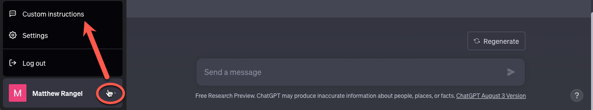
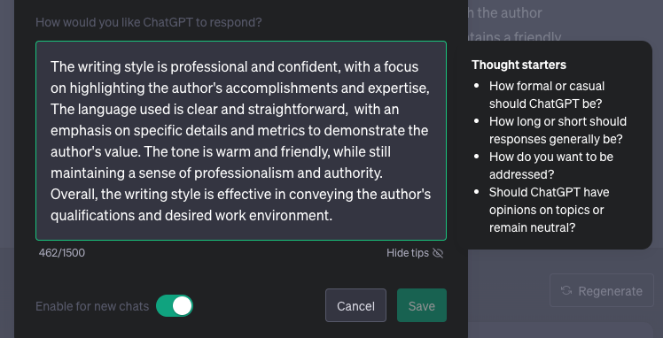

# Incoming!!! _Another_ AI-assisting Inspired Build

[comment]: <> (Goal is heavily inspired from https://medium.com/@carriewinecoffshevelson/im-building-a-ai-assisted-job-hunter-with-chatgpt-while-my-baby-naps-a858b63bedaa)

## Goal

To get a helper to help speed up job hunting while staying organized and saving time writing resumes and cover letters, finding roles, applying, and keeping track of my opportunities.

> ## Can I get a helper to speed things up

Utilize [ChatGPT](https://openai.com/blog/chatgpt) to your advantage. Make it sound "like you". We have all used it and noticed that it definitely works, but it's not incredibly accurate and the more you use it, the more you can spot when it gets used.

> Lets go ahead and add how ChatGPT responds to your prompts. This is **KEY**.

First, go to your ChatGPT dashboard, and got the the bottom where your name is and click on the three dots.

Once that's clicked go to custom instructions and enter your prompt on how you want to sound.

You must be concise and specific in the prompt.

> ## Idea Generation

Ask ChatGPT what tools I could use for gathering my job opportunity list by scraping the web.

By telling ChatGPT your goal and your current approach, you can discover alternatives.

Keep your chats organized, separating out very different topics from each other into different chats. So you want to keep your chat on steps how to make a great pot roast from a chat about tuning your resume.

Although I am well equipped to use code to scrape the web for relevant job postings, I wanted to use a no-code and low-code tools to get this job done. I will move forward with using [Browse AI](https://www.browse.ai/).

After you sign in to Brows AI

[<---BACK](README.md)
