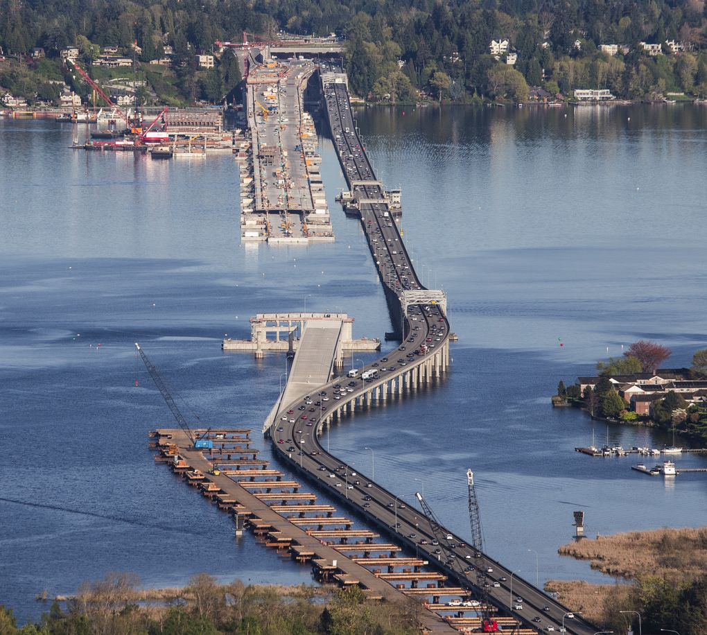
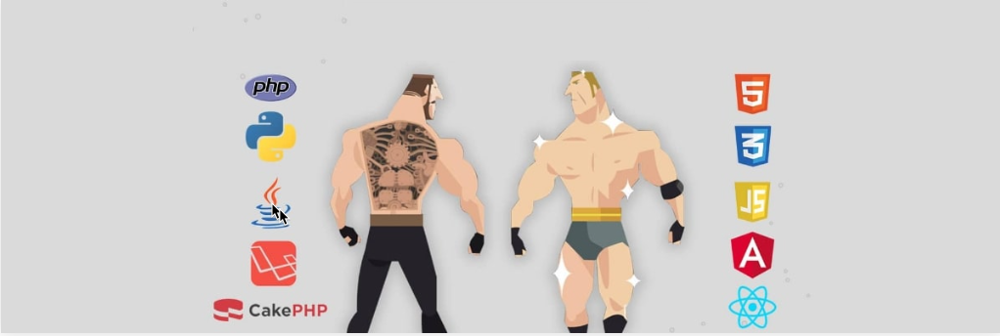

# The Transferable Skills Between Construction Project Management and Tech

## Matt Rangel

## 9/7/2023

There are a lot of similarities between Construction Project Management and Tech Project Management.

- Moving from the conception of an idea to creating a timeline to make it real.
- Capture a scope and build a budget to show if it’s feasible and if the key stakeholders are interested in building this out.
- Now, will it sell.

Buildings or technology, the levers are the same: time, scope, money.

I’ve had the advantage of building projects in multiple roles.

- Construction Field
- Construction Office
- Software Developer

I have found that building with tools and skills in the construction field/office is not much different than building with tools in web/app development. In both cases, it’s about learning the tools, the systems, and where to pattern match vs innovate.

When working in the construction field, we would use blueprints to guide SMEs to install in their respective crafts, collaboratively.

> ### For example, two ends of a bridge connecting

Without proper communication, this 520 bridge would take a much longer time if it didn't have proper communication to connect (it did, I was on this project, or rather _in_ this project!).

The same thing applies to Software Development. Especially when it comes to connecting the frontend of the application,using API’s as the connecting point.

If not properly documented or communicated, there could be assumptions and potential rework, which can provide an increase in schedule and/or budget.

> Project Managers in both industries juggle multiple projects at once

Considering the constant ebb and flow of the project life cycle and the overlap of building current projects and scoping potential future projects. They work with stakeholders about potential projects, to see if there’s enough benefit to the overall company for the team to build. And ongoing projects to share if they’re going as planned. Which, as a PM you should know that they rarely go exactly as planned,(incoming Lessons Learned!). 😉

The PMs create a safety net where the PMO (Project Management Office) flags something that needs to be addressed, so the SMEs so they can focus on their respective crafts. This allows the SME’s have a high level view, while the PMO focuses on making sure the ducks are lined up to be knocked down… or something like that.

In the end, we all have a project manager within us. Planned a vacation? Pulled together a birthday party? Moved to another home? All of these share the frameworks of Project Management. Each value the specific skill set of a PM, regardless of how different the project appears to be.

Which PM skill set is important for your organization

- [Github Repo](https://github.com/rangelMatt)
- [The Transferable Skills Between Construction Project Management and Tech](https://rangelmatt.github.io/reading-notes/newsLetter/PMSkillsCMtoTech)

[<---BACK](README.md)
