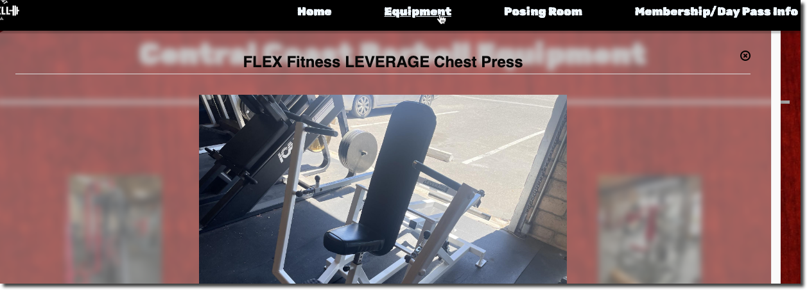

# First Paid App

## Matt Rangel

## 2/2/2023

Hey everyone! Check out my first paid gig, [here](https://centralcoastbarbell.com/)
It's a website for a local gym that I built while studying to help balance "theoretical learning" with "tangible implementation". It's built with React, CSS, SASS, and deployed on Netlifly.

On the `Equipment` page, I'm dynamically grabbing the equipment image, title, and description from a data page, which you can see by clicking their respective buttons and a modal pops up.

It's very simple and barely scratches the surface of what I'm capable of. But hey, it's nice to have someone pay for what you built.

I had a lot of fun collaborating with the gym owner and I'm glad they're very pleased with the result.

From here, I'll be building out apps to help solidify a couple of learning opportunities I identified from building this app and diving deeper into React. Always looking to grow and expand my skill set as I continue my job search to break into tech!

Best,

Matt Rangel

(The above web app was built entirely from scratch code. If interested, I can help design and build apps from [Wix](https://www.wix.com/app-builder) and/or [Wordpress](https://wordpress.com/). If you or someone you know is interested, just reach out and let me know!)

- [Github Repo](https://github.com/rangelMatt)
- [First Paid App](https://rangelmatt.github.io/reading-notes/newsLetter/firstPaidApp.html)

[<---BACK](README.md)
