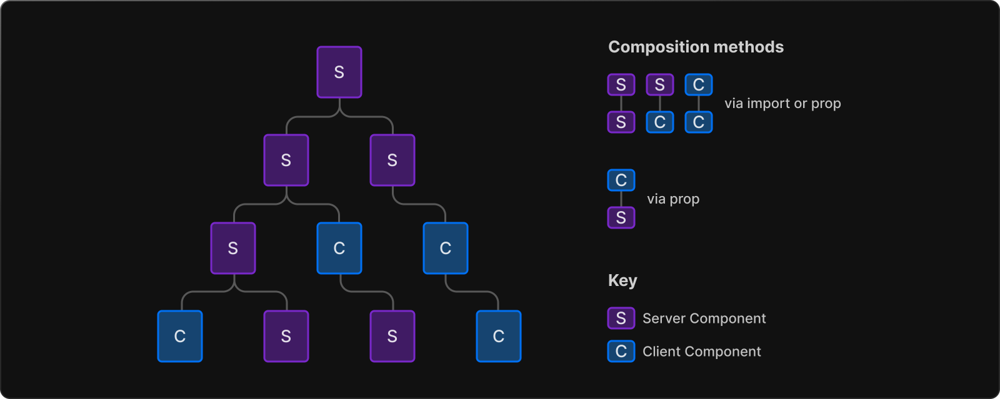

# Rendering Fundamentals Reading Notes

**Rendering** converts the cod you write into user interfaces

## Rendering Environments

There are two environments where an application code can be rendered: the **client** and the server.

- The **client** refers to the browser on a user's device that sends a request to a server for your application code. It then turns the response from the server into an interface the user can interact with.
- The **server** refers to the computer in a data center that stores your application code, receives requests from a client, does some computation, and sends back an appropriate response.

## Component-level Client and Server Rendering

Before React 18, the primary way to render your application **using React** was entirely on the client.

With Next.js, there is an easier way to break down your application into **pages** and prerender on the server by generating HTML and sending it to the client to be [hydrated](https://react.dev/reference/react-dom/client/hydrateRoot#hydrating-server-rendered-html) by React. However, this led to additional JavaScript needed on the client to make the initial HTML interactive.

Now, with Server and Client Components, React can render on the client **and** the server meaning you can choose the rendering environment at the component level.

By default, the `app` directory uses Server Components, allowing you to easily render components on the server and reducing the amount of JavaScript sent to the client.

You can interleave Server and Client Components in a component tree by importing a Client Component into a Server component, or by passing a Server Component as a child or a prop to a Client Component. Behind the scenes, React will merge the work of both environments.



## Static and Dynamic Rendering on the Server

In addition to client-side and server-side rendering with React components, Next.js gives you the option to optimze rendering on the server with **Static** and **Dynamic Rendering**

### Static Rendering

With **Static Rendering**, both Server _and_ Client Components can be prerendered on the server at **build time**. The result of the work is cached and reused on subsequent requests. The cached result can also be revalidated.

```note

This is equivalent to Static Site Generation(SSG) and Incremental Static Regeneration(ISR)

```

Server and Client components are rendered differently during Static Rendering:

- Client Components have their HTML and JSON prerendered and cached on the server. The cached result is then sent to the client for hydration.
- Server Components are rendered on the server by React, and their payload is used to generate HTML. The same rendered payload is also used to hydrate the components on the client, resulting in no JavaScript needed on the client.

### Dynamic Rendering

With **Dynamic Rendering**, both Server and Client Components are rendered on the server at **request time**. The result of the work is not cached.

```note
This is equivalent to Server-Side Rendering(getServiceSideProps()).
```

## Edge and Node.js Runtimes

On the server, there are two runtimes where your pages can be rendered:

- The **Node.js Runtime** (default) has access to all Node.js APIs and compatible packages from the ecosystem.
- The **Edge Runtime** is based on Web APIs.

Both runtimes support streaming from the server,depending on your deployment infrastructure.

## Reference

## [Rendering Fundamentals](https://beta.nextjs.org/docs/rendering/fundamentals)

[<---BACK](README.md)
